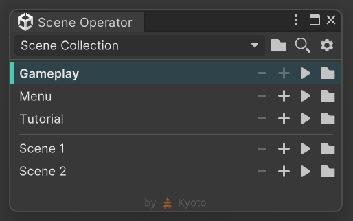
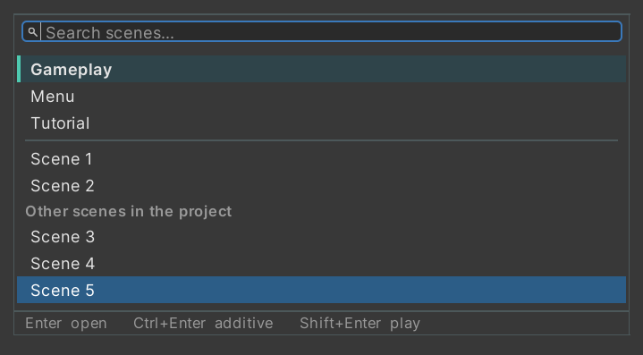

# Scene Operator

Scene management for the Unity editor: the scenes you actually work with in one list, one click away -
plus a searchable quick switcher on a keyboard shortcut.



## Collections

A **Scene Collection** is an asset holding the scenes you work with, split into groups.
Create one through `Assets > Create > Scene Operator > Scene Collection` and fill the groups in the Inspector.

Groups only separate scenes visually: the window shows one flat list with a divider between groups.
Their names are hidden by default and can be turned on in the preferences.

## Window

`Tools > Scene Operator`

| Action | Result |
| --- | --- |
| Click a row | Open the scene, replacing the open ones |
| Ctrl+click a row | Open the scene additively |
| **−** | Close the scene |
| **+** | Open the scene additively |
| **▶** | Open the scene alone and enter play mode |
| **folder** | Show the scene in the Project window |
| Right-click a row | All of the above, plus *Set Active*, *Save* and *Open Whole Group* |

Rows show what is going on: open scenes are tinted, the active scene is bold with a colored stripe,
unsaved changes get an asterisk, and scene assets missing from the project are greyed out instead of
silently disappearing from the list.

The toolbar holds the collection picker, a button to show that collection in the Project window,
the scene switcher and the preferences.

## Scene switcher

`Ctrl+Shift+O` (rebindable) or `Tools > Scene Switcher`



A search field over the scenes of the selected collection and, below the divider, every other scene of
the project. Typing filters by scene name and by folder, so scenes sharing a name stay apart.

| Key | Result |
| --- | --- |
| ↑ / ↓ | Move the selection |
| Enter | Open |
| Ctrl+Enter | Open additively |
| Shift+Enter | Open and enter play mode |
| Esc | Close |

## Preferences

`Edit > Preferences > Scene Operator`

- **Shortcuts** — rebind the switcher and the window. Unity's own "Default" profile is read-only, so the
  page offers to create a personal profile first; every other shortcut is carried over.
- **Window** — show group names, row height.
- **Scene switcher** — include all project scenes, show folders, maximum height.
- **Colors** — every color the tool draws, stored separately for the dark and the light editor theme,
  with a reset button.

## Installation

Requires Unity 2022.3 or newer. Package Manager → `+` → *Install package from git URL…*:

```
https://github.com/qKyoto/SceneOperator.git
```

Append `#v2.0.0` to the URL to pin that version. Alternatively, copy the package folder into your
project's `Packages/` directory.

The tool is editor-only - nothing of it is compiled into builds.

## License

MIT
